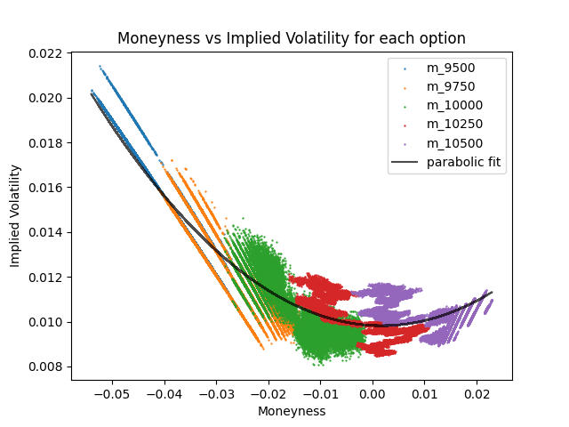
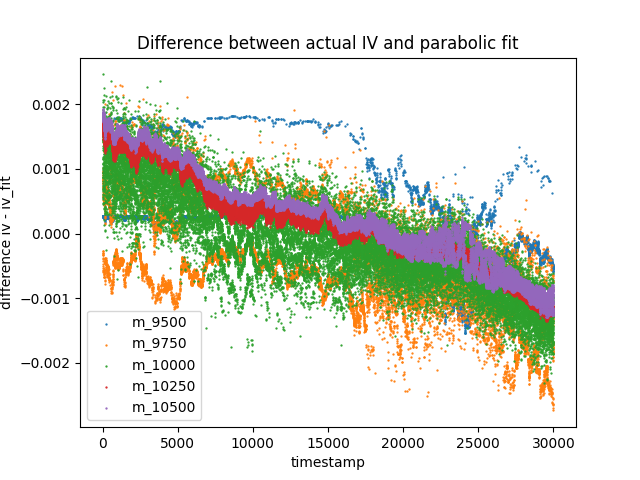
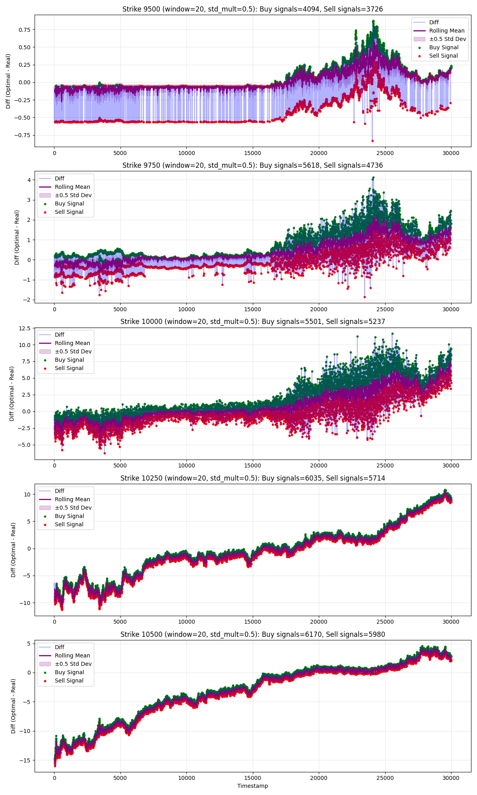

# Black-Scholes Options Pricing and Trading Research

## Project Summary

This project implements a quantitative trading strategy for European call options using the Black-Scholes model within a simulated high-frequency trading environment. The strategy identifies mispricings by comparing theoretical option values derived from volatility surfaces against observed market prices, generating trading signals for profitable execution. The implementation includes a complete option pricer, implied volatility calculator, volatility surface fitting, and results of the implementation on a full in-game trading day.

## 1. Introduction

### Project Context

This research was conducted within IMC Trading's annual algorithmic trading competition, which provides realistic market simulation data identical to what traders encounter at professional trading firms. Unlike using real financial data, this controlled environment allows us to focus on strategy research and testing.

### Market Environment

The trading environment features five European call options on a single underlying asset (VOLCANIC_ROCK) with different strike prices:
- Strike prices: 9500, 9750, 10000, 10250, 10500
- Time to expiration: 4 days (constant)
- Data available: bid/ask prices and volumes at each timestamp
- Position limits: constrained short/long positions per option
- Objective: identify and profit from mispriced options

### Strategy Overview

The core insight is that the Black-Scholes model's implied volatility exhibits structure across different strike prices and moneyness levels. Real market prices deviate from this theoretical structure, creating exploitable mispricings. Our approach:

1. Calculate implied volatility for each option from observed market prices
2. Map implied volatility against moneyness to reveal the volatility surface
3. Fit a quadratic surface to smooth noise and identify the "fair" volatility curve
4. Use fitted volatility to compute theoretical prices
5. Trade when market prices deviate significantly from theoretical values

## 2. Methodology

### 2.1 Black-Scholes Framework

The Black-Scholes formula for a European call option is:

$$C = S_t \cdot N(d_1) - K \cdot e^{-rT} \cdot N(d_2)$$

Where:
- $S_t$ is the current underlying price
- $K$ is the strike price
- $T$ is time to expiration
- $r$ is the risk-free rate (set to 0 in this virtual market)
- $\sigma$ is volatility
- $d_1 = \frac{\ln(S_t/K) + (r + \sigma^2/2)T}{\sigma\sqrt{T}}$
- $d_2 = d_1 - \sigma\sqrt{T}$
- $N(\cdot)$ is the standard normal cumulative distribution function

### 2.2 Implied Volatility Calculation

From market-observed option prices, we invert the Black-Scholes formula to extract the implied volatility using Newton-Raphson iteration:

$$\sigma_{n+1} = \sigma_n - \frac{BS(\sigma_n) - V_{\text{market}}}{\text{vega}(\sigma_n)}$$

Where vega (the sensitivity of option price to volatility) is:

$$\text{vega} = S_t \cdot N'(d_1) \cdot \sqrt{T}$$

This iterative approach converges quickly and reliably for typical option parameters. We use an initial guess of 0.2 (20% volatility) and iterate until the computed price matches observed market price within a tolerance of $10^{-3}$.

### 2.3 Moneyness and Volatility Surface

For each option, we compute moneyness as:

$$m = \frac{\ln(K/S_t)}{\sqrt{T}}$$

Plotting implied volatility against moneyness across all five strike prices reveals the volatility surface structure. Instead of treating each IV observation independently, we fit a quadratic curve through the five moneyness-IV points at each timestamp:

$$\text{IV}(m) = a \cdot m^2 + b \cdot m + c$$

This quadratic fit serves multiple purposes:
- **Noise reduction**: Market prices contain microstructure noise; fitting smooths these fluctuations
- **Interpolation**: enables theoretical pricing at any moneyness, not just observed strikes
- **Extrapolation**: provides estimates for strikes beyond our data
- **Structural preservation**: quadratic form captures realistic volatility smirk/smile patterns observed in real markets

The coefficients $a$, $b$, $c$ are computed using least-squares regression at each timestamp where at least three options have valid IV values.

### 2.4 Signal Generation

With the fitted volatility surface in hand, we compute a "theoretical fair price" for each option by plugging the fitted IV back into Black-Scholes. We then compare this to the observed mid-market price:

$$\text{diff}_{t} = \text{BS Price}(IV_{\text{fitted}}) - \text{Market Price}_{t}$$

To generate robust trading signals, we apply a rolling-window standardization approach:

1. Compute a rolling mean of the difference (window size: tunable parameter)
2. Compute rolling standard deviation
3. Generate a BUY signal when: $\text{diff}_t < \text{mean}_t - k \cdot \text{std}_t$ (underpriced)
4. Generate a SELL signal when: $\text{diff}_t > \text{mean}_t + k \cdot \text{std}_t$ (overpriced)

Where $k$ is the number of standard deviations (another tunable parameter, typically 1-2).

This approach converts absolute price deviations into relative outliers, which are more reliable indicators of true mispricings.

## 3. Implementation
### 3.1 Implied Volatility Against Moneyness

The first stage of implementation applies the theoretical framework from Section 2 to historical market data. For each timestamp, we extract the observed option prices and compute the corresponding implied volatilities using the Newton-Raphson algorithm described in Section 2.2.

Once computed, these implied volatilities are plotted against the moneyness of their respective strikes (Section 2.3). Rather than using these raw, noisy observations directly for subsequent pricing decisions, we fit a quadratic function through all available points:

$$\sigma_{\text{fit}}(m) = a \cdot m^2 + b \cdot m + c$$

This fitted surface serves as a smoothed, noise-reduced estimate of the true volatility term structure at that moment in time. 

Figure 3.1

Figure 3.2

### 3.2 Theoretical Pricing via Fitted Volatility Surface

With the quadratic volatility surface established, we now possess the capacity to compute a theoretical fair price for each option. The procedure is straightforward:

1. Calculate moneyness for the target option: $m = \frac{\ln(K/S_t)}{\sqrt{T}}$
2. Evaluate the fitted surface at this moneyness: $\sigma_{\text{fit}} = a \cdot m^2 + b \cdot m + c$
3. Plug this volatility into Black-Scholes to obtain the theoretical price: $\text{Price}_{\text{theoretical}} = \text{BS}(S_t, K, r, T, \sigma_{\text{fit}})$

The comparison between this theoretical price and the observed market mid-price reveals potential mispricings:

$$\text{Mispricing}_t = \text{Price}_{\text{theoretical}} - \text{Price}_{\text{market}}$$

A positive value indicates an underpriced option (trading below fair value); a negative value indicates overpricing.

### 3.3 Signal Generation via Rolling Standardization

Direct use of the mispricing signal proves unreliable because the average difference between the theoretical implied volatility and the real implied volatility seems to shift over time (figure 3.2). Therefore static tresholds would not work as a signal. To standardize the price difference we use a rolling average and compare the current difference in price to the rolling average price:

1. Compute the rolling mean of mispricings over the past $w$ observations: $\mu_t = \frac{1}{w} \sum_{i=t-w}^{t} \text{Mispricing}_i$
2. Compute the rolling standard deviation: $\sigma_t = \sqrt{\frac{1}{w} \sum_{i=t-w}^{t} (\text{Mispricing}_i - \mu_t)^2}$
3. Standardize the current mispricing: $z_t = \frac{\text{Mispricing}_t - \mu_t}{\sigma_t}$
4. Generate signals based on deviation from the rolling mean:
   - **BUY signal**: when $z_t < -k$ (option is $k$ standard deviations below its rolling mean—significantly underpriced)
   - **SELL signal**: when $z_t > +k$ (option is $k$ standard deviations above its rolling mean—significantly overpriced)

Where $w$ (window size) and $k$ (threshold) are tunable parameters optimized in Section 4.

Below is a visualization of this signal for each strike using a rolling average window of 20 and a treshold of 0.5 standard deviation from the rolling average.

## 4. Results of the signal
The strategy generated heterogeneous results across the five options, reflecting differences in moneyness, implied volatility regime, and local mispricing patterns:

### 4.1 Final P&L of 1 full trading day (1 million timestamps)

| Strike | Option | Profit/Loss (in-game currency) |
|--------|--------|------------------------|
| 10,500 | VOLCANIC_ROCK_VOUCHER_10500 | -25,493 |
| 10,250 | VOLCANIC_ROCK_VOUCHER_10250 | -14,934 |
| 10,000 | VOLCANIC_ROCK_VOUCHER_10000 | +143,557 |
| 9,750 | VOLCANIC_ROCK_VOUCHER_9750 | +45,836 |
| 9,500 | VOLCANIC_ROCK_VOUCHER_9500 | -75,457 |
| | **Total Profit** | **+73,508** |

### 4.2 P&L analysis of each product

| Strike | Trades | Wins | Losses | Win Rate | Total P&L | Avg P&L | Avg Win | Avg Loss |
|--------|--------|------|--------|----------|-----------|---------|---------|----------|
| 9500 | 6,205 | 2,706 | 3,499 | 43.61% | -82,737 | -13.33 | 86.30 | -96.81 |
| 9750 | 4,396 | 2,271 | 2,125 | 51.66% | 40,571 | 9.23 | 103.24 | -97.63 |
| 10000 | 5,803 | 3,296 | 2,507 | 56.80% | 142,836 | 24.61 | 91.21 | -68.52 |
| 10250 | 3,369 | 1,338 | 2,031 | 39.72% | -17,234 | -5.12 | 38.62 | -40.97 |
| 10500 | 6,052 | 325 | 5,727 | 5.37% | -26,405 | -4.36 | 12.10 | -9.44 |

### 4.3 Key Observations

**Positive Net Performance**: Despite losses on three of the five strike prices, the strategy achieved a cumulative profit of 73,508 across the full trading day. This positive result on unseen data provides evidence that the signal captures genuine market inefficiencies rather than artifacts of the fitting procedure.

**Strike-Dependent Performance**: The results exhibit a clear pattern: profitability concentrated at the at-the-money (ATM, strike 10,000) and slightly out-of-the-money (strike 9,750) options, with losses at the extreme strikes (9,500 and 10,500). This suggests the volatility surface fitting is most reliable in the central moneyness region where data density is highest and extrapolation uncertainty is minimal.

## Appendix: File Structure

- `black_scholes.ipynb`: Complete implementation with Black-Scholes pricer, IV calculator, volatility curve fitting, and signal generator.
- `volcanic_rock_trader.py`: Trader used for the third party backtest which calculates and uses the signal to execute trades.
